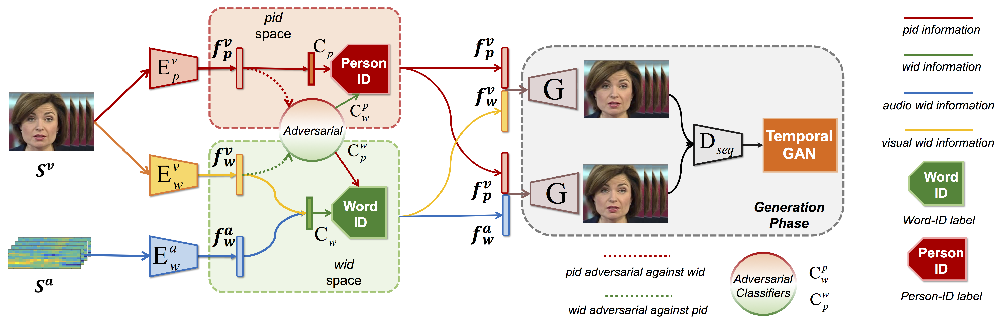
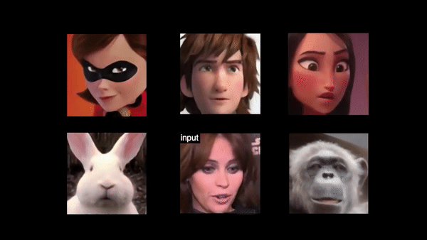

# Talking Face Generation by Adversarially Disentangled Audio-Visual Representation

We propose `Disentangled Audio-Visual System (DAVS)` to address arbitrary-subject talking face generation in this work, which aims to synthesize a sequence of face images
that correspond to given speech semantics, conditioning on either an unconstrained speech audio or video.

[[Project]](https://liuziwei7.github.io/projects/TalkingFace) [[Paper]](https://arxiv.org/abs/1807.07860) [[Demo]](https://www.youtube.com/watch?v=-J2zANwdjcQ)



## Requirements
* [python 2.7](https://www.python.org/download/releases/2.7/)
* [PyTorch](https://pytorch.org/)（We use version 0.2.0) 
* [opencv2](https://opencv.org/releases.html)

## Generating test results
* Download the pre-trained model [checkpoint](https://drive.google.com/open?id=1UW22xm4r9AewNoySyPd2fyUab0nqymBR)
``` bash
Create the default folder "checkpoints" and put the checkpoint in it or get the CHECKPOINT_PATH
``` 

* Samples for testing can be found in this folder named [0572_0019_0003](https://drive.google.com/open?id=1ykjOZwwFfyP2V1vdUVsm2v4r1QSM-uxa). This is a pre-processed sample from the [Voxceleb](http://www.robots.ox.ac.uk/~vgg/data/voxceleb/) Dataset. 

* Run the testing script to generate videos from video:

``` bash
python test_all.py  --test_root './0572_0019_0003/video' --test_type 'video' --test_audio_video_length 99 --test_resume_path CHECKPOINT_PATH 
```
* Run the testing script to generate videos from audio:
``` bash
python test_all.py  --test_root './0572_0019_0003/audio' --test_type 'audio' --test_audio_video_length 99 --test_resume_path CHECKPOINT_PATH 
```

## Sample Results
* Talking Effect on Human Characters


* Talking Effect on Non-human Characters (Trained on Human Faces Only)


## Create more samples

* The face detection tool used in the demo videos can be found at [RSA](https://github.com/sciencefans/RSA-for-object-detection). It will return a Matfile with 5 key point locations in a row for each image. Other face alignment methods are also appliable such as [dlib](http://blog.dlib.net/2014/08/real-time-face-pose-estimation.html). The key points for face alignement we used are the two for the center of the eyes and the average point of the corners of the mouth. With each image's PATH and the face POINTS, you can find our way of face alignment at `preprocess/face_align.py`.

* Our preprocessing of the audio files is the same and borrowed from the matlab code of [SyncNet](http://www.robots.ox.ac.uk/~vgg/software/lipsync/). Then we save the mfcc features into bin files.

## Training code

* Training code is preparing and will be released later.

## Postprocessing Details （Optional）

* The directly generated results may suffer from a "zoom-in-and-out" condition which we assume is caused by our alignment of the training set. We solve the unstable problem using [Subspace Video Stabilization](http://web.cecs.pdx.edu/~fliu/papers/tog2010.pdf) in the demos.

## License and Citation
The use of this software is RESTRICTED to **non-commercial research and educational purposes**.

```
@inproceedings{zhou2019talking,
  title     = {Talking Face Generation by Adversarially Disentangled Audio-Visual Representation},
  author    = {Zhou, Hang and Liu, Yu and Liu, Ziwei and Luo, Ping and Wang, Xiaogang},
  booktitle = {AAAI},
  year      = {2019},
}
```

## Acknowledgement
The structure of this code is borrowed from [pix2pix](https://github.com/junyanz/pytorch-CycleGAN-and-pix2pix).

